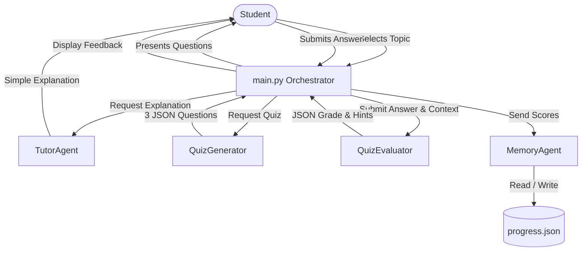
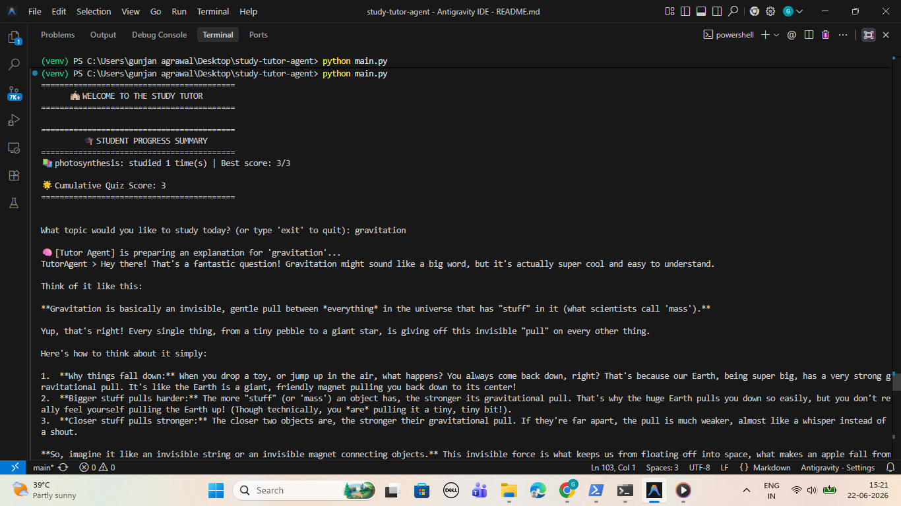
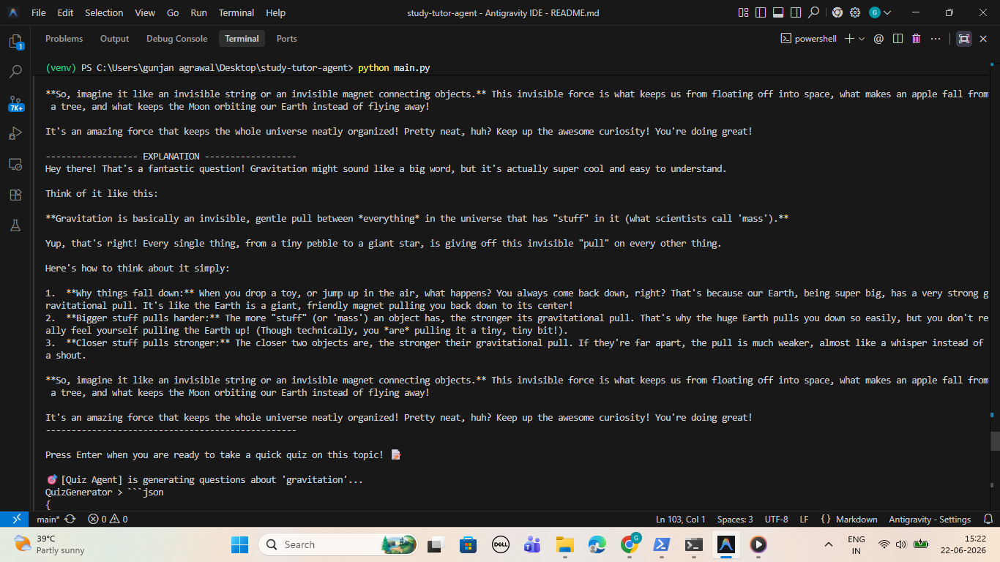
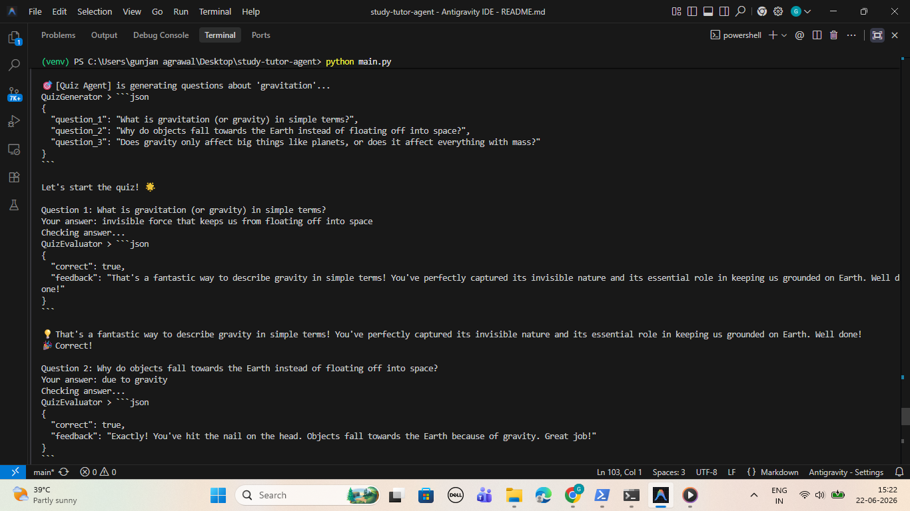
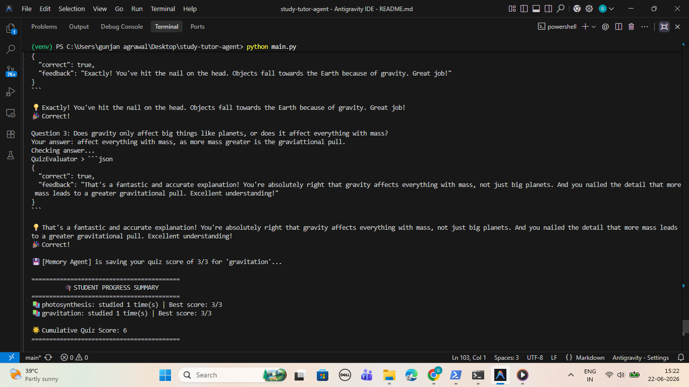

# 🎓 Study Tutor Agent

Welcome to the **Study Tutor Agent** capstone project! This is an interactive, multi-agent AI system built using the **Google Agent Development Kit (ADK)**. It acts as a personal study assistant that explains academic topics in simple language, quizzes students to reinforce learning, provides hints instead of giving answers directly, and persistently tracks progress.

---

## 📌 Problem & Solution

### The Problem
Traditional learning resources often suffer from two main issues:
1. **Complexity:** Explanations are often filled with technical jargon that makes new topics intimidating for students.
2. **Passive Learning:** Students read material without immediate feedback or reinforcement, and homework answers are often given away directly, preventing critical thinking.

### The Solution
The **Study Tutor Agent** solves these challenges by combining three specialized agents into a cohesive multi-agent workflow:
- **Simple, jargon-free explanations** utilizing analogies and a warm, positive tone.
- **Active retrieval practice** via custom 3-question quizzes on the explained topic.
- **Supportive feedback** that gives hints and encouragement instead of direct answers to guide the student to the correct solution.
- **Progress Tracking** that saves the student's study history and quiz scores locally.

---

## 🏗️ Architecture

The application is structured around a multi-agent orchestration pattern where specialized agents coordinate to guide the student:



### Components
1. **`main.py` (Orchestrator):** The entry point that manages the execution loop, runner instantiation, CLI inputs/outputs, and handles JSON parsing of the agent responses.
2. **`tutor_agent.py` (Explainer):** A friendly agent powered by `gemini-2.5-flash` trained to explain any topic simply.
3. **`quiz_agent.py` (Quiz Master):**
   - **`QuizGenerator`:** Generates exactly 3 clear, beginner-friendly questions.
   - **`QuizEvaluator`:** Evaluates student answers, checks correctness, and generates helpful hints without revealing the answer.
4. **`memory_agent.py` (Progress Tracker):** A helper agent that tracks the student's study sessions, cumulative quiz scores, and history in a local `progress.json` file.

---

## 📸 Screenshots

Here is a preview of the Study Tutor Agent in action:

| 1. Topic Explanation | 2. Quiz Generation |
| :---: | :---: |
|  |  |
| **3. Taking the Quiz** | **4. Progress Saved** |
|  |  |

---

## ⚙️ Setup Instructions

### Prerequisites
- Python 3.12+ installed
- A Google Gemini API Key. You can get one from the [Google AI Studio](https://ai.google.dev/gemini-api/docs/api-key).

### Installation & Execution

1. **Navigate to the Project Folder**:
   ```bash
   cd "C:\Users\gunjan agrawal\Desktop\study-tutor-agent"
   ```

2. **Activate the Virtual Environment**:
   - On **Windows (PowerShell)**:
     ```powershell
     .\venv\Scripts\Activate.ps1
     ```
   - On **Windows (Command Prompt)**:
     ```cmd
     .\venv\Scripts\activate.bat
     ```

3. **Install Dependencies**:
   ```bash
   pip install -r requirements.txt
   ```

4. **Set Up your Gemini API Key**:
   When you run the application for the first time, it will prompt you for your Gemini API key and save it to a `.env` file automatically.
   Alternatively, you can create a `.env` file in the root folder manually:
   ```env
   GEMINI_API_KEY=your_gemini_api_key_here
   ```

5. **Run the Tutor**:
   ```bash
   python main.py
   ```

---

## 📁 Project Directory Structure

- [main.py](file:///C:/Users/gunjan%20agrawal/Desktop/study-tutor-agent/main.py) - Main orchestrator CLI loop.
- [tutor_agent.py](file:///C:/Users/gunjan%20agrawal/Desktop/study-tutor-agent/tutor_agent.py) - Explainer tutor agent.
- [quiz_agent.py](file:///C:/Users/gunjan%20agrawal/Desktop/study-tutor-agent/quiz_agent.py) - Quiz generation and evaluation agents.
- [memory_agent.py](file:///C:/Users/gunjan%20agrawal/Desktop/study-tutor-agent/memory_agent.py) - Local file database logic.
- [requirements.txt](file:///C:/Users/gunjan%20agrawal/Desktop/study-tutor-agent/requirements.txt) - Dependencies list.
- [AGENTS.md](file:///C:/Users/gunjan%20agrawal/Desktop/study-tutor-agent/AGENTS.md) - System definition and instruction parameters.
